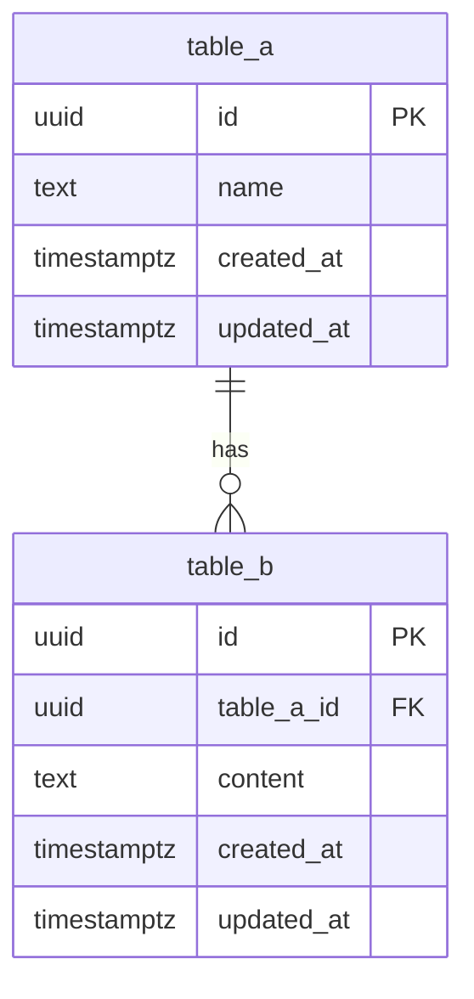

# /db-design - DB設計スキル

## 概要

データベースの論理設計・物理設計を行います。
ER図の作成、テーブル定義、リレーション設計、インデックス設計をサポートします。

## 使用方法

```
/db-design [テーブル名]
/db-design [テーブル名] --relations
/db-design all --erd
```

## 出力テンプレート

### 1. ER図 (Mermaid)



### 2. テーブル定義書

| テーブル名 | 論理名 | 説明 |
|-----------|--------|------|
| table_a | テーブルA | 説明 |
| table_b | テーブルB | 説明 |

### 3. カラム定義

| カラム名 | 型 | NULL | デフォルト | 説明 |
|---------|-----|------|-----------|------|
| id | UUID | NO | gen_random_uuid() | 主キー |
| name | TEXT | NO | - | 名前 |
| created_at | TIMESTAMPTZ | NO | NOW() | 作成日時 |
| updated_at | TIMESTAMPTZ | NO | NOW() | 更新日時 |

### 4. インデックス設計

```sql
CREATE INDEX [table]_[column]_idx ON [table] ([column]);
CREATE INDEX [table]_created_at_idx ON [table] (created_at DESC);

-- 部分インデックス
CREATE INDEX [table]_[column]_idx ON [table] ([column]) WHERE [condition];

-- 複合ユニークインデックス
CREATE UNIQUE INDEX [table]_[col1]_[col2]_idx ON [table] ([col1], [col2]);
```

### 5. 外部キー制約

```sql
ALTER TABLE [child_table]
  ADD CONSTRAINT [child_table]_[parent_table]_id_fkey
  FOREIGN KEY ([parent_table]_id) REFERENCES [parent_table](id)
  ON DELETE CASCADE;
```

## 設計パターン

### 1. 1対多 (One-to-Many)

```
parent ||--o{ child
```

- 親テーブルに主キー
- 子テーブルに外部キー
- CASCADE DELETE を検討

### 2. 多対多 (Many-to-Many)

```
table_a }o--o{ table_b (through junction_table)
```

- 中間テーブルを作成
- 複合ユニーク制約で重複防止

### 3. 自己参照

```sql
-- 階層構造 (例: 返信、カテゴリ)
ALTER TABLE [table] ADD COLUMN parent_id UUID REFERENCES [table](id);
```

## 非正規化の判断

### カウントの非正規化

```sql
-- 正規化: 毎回COUNT
SELECT COUNT(*) FROM [child_table] WHERE [parent_id] = ?;

-- 非正規化: [parent_table].[count_column] を更新
-- メリット: 読み取り高速
-- デメリット: 更新時の整合性管理が必要
```

トリガーで自動更新:

```sql
CREATE OR REPLACE FUNCTION update_[column]_count()
RETURNS TRIGGER AS $$
BEGIN
  IF TG_OP = 'INSERT' THEN
    UPDATE [parent_table] SET [count_column] = [count_column] + 1
    WHERE id = NEW.[parent_id];
  ELSIF TG_OP = 'DELETE' THEN
    UPDATE [parent_table] SET [count_column] = [count_column] - 1
    WHERE id = OLD.[parent_id];
  END IF;
  RETURN NULL;
END;
$$ LANGUAGE plpgsql;

CREATE TRIGGER [column]_count_trigger
AFTER INSERT OR DELETE ON [child_table]
FOR EACH ROW EXECUTE FUNCTION update_[column]_count();
```

## ファイル配置

```
docs/
└── db/
    ├── erd.md              # ER図 (Mermaid)
    ├── tables/
    │   └── [table_name].md # 各テーブル定義
    └── indexes.md          # インデックス一覧

apps/api/src/db/
├── schema/
│   └── [001_table_name].sql
└── migrations/
    └── ...
```

## ベストプラクティス

1. 正規化を基本とし、必要に応じて非正規化
2. UUID を主キーに使用 (分散環境対応)
3. created_at, updated_at は必須
4. 外部キー制約で整合性を担保
5. 適切なインデックスを設計
6. RLS (Row Level Security) を必ず設定
7. 論理削除より物理削除を推奨 (Supabase では RLS で制御)
